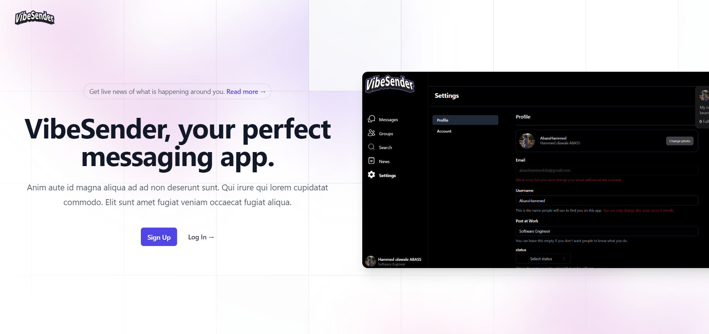
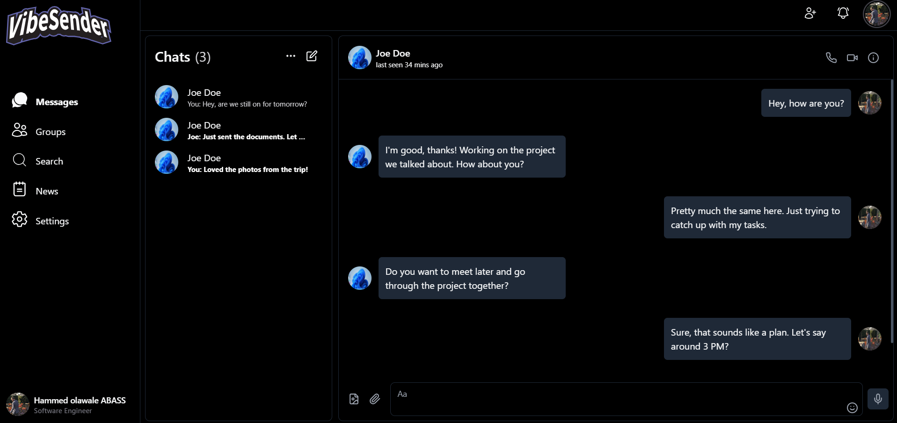
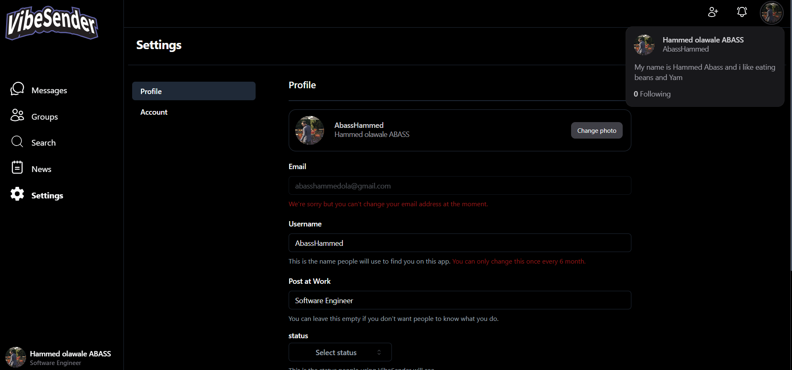

<div align="center">
  
</div>
<h1 align="center">
  VibeSender
</h1>



#### VibeSender is a dynamic messaging app designed for modern communication.



## Settings Page



## 🛠 Installation & Set Up

1. Download the repo :up:

   > [click here](https://github.com/AbassHammed/VibeSender)

2. Install and use the correct version of Node using [NVM](https://github.com/nvm-sh/nvm)

   ```sh
   nvm install
   ```

3. Install dependencies from the directory path

   ```sh
   npm install
   ```

4. Create your `.env.local` file

   > Since i am using Firebase for the authentication, you will need to create an app on Firebase and copy your App Firebase API key etc

5. Start the development server

   ```sh
   npm run dev
   ```

## 🚀 Building and Running for Production

1. Generate a full static production build

   ```sh
   npm run build
   ```

1. Preview the site as it will appear once deployed

   ```sh
   npm run start
   ```
